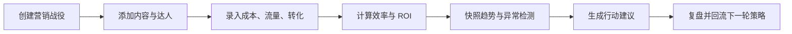
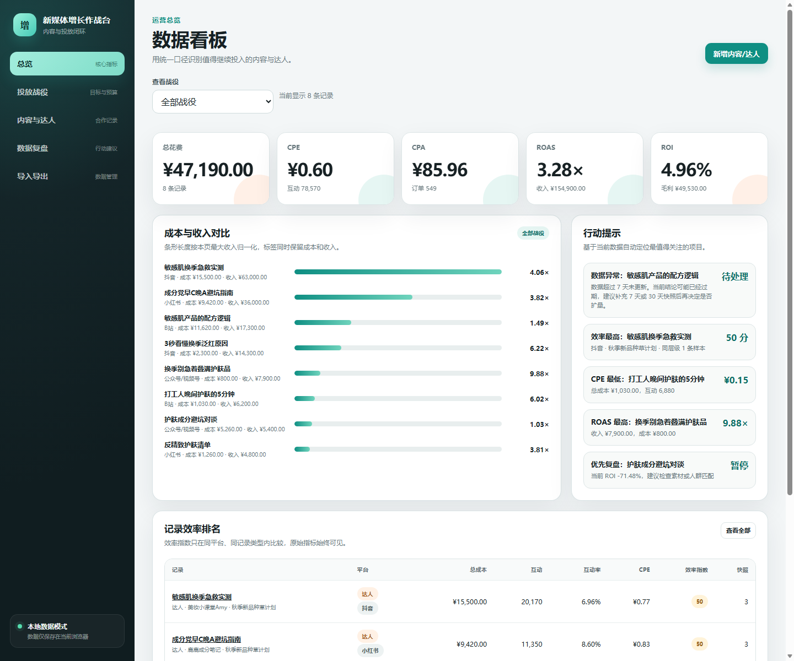
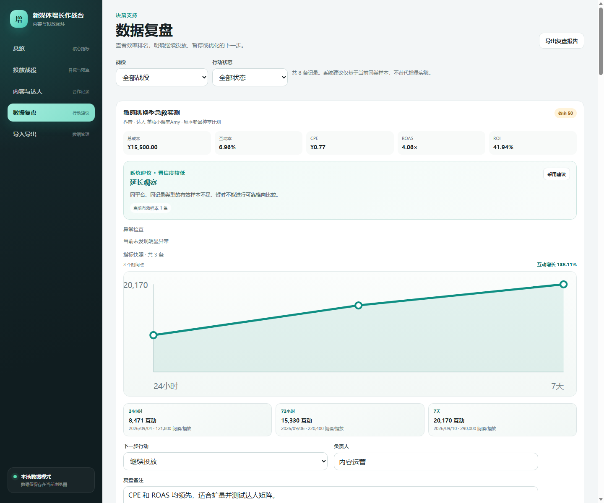
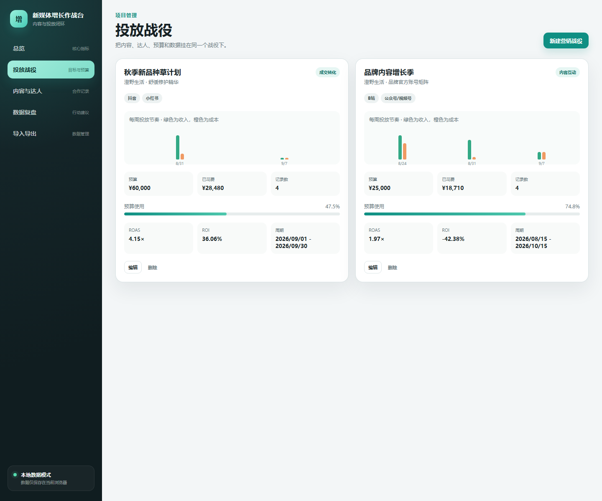
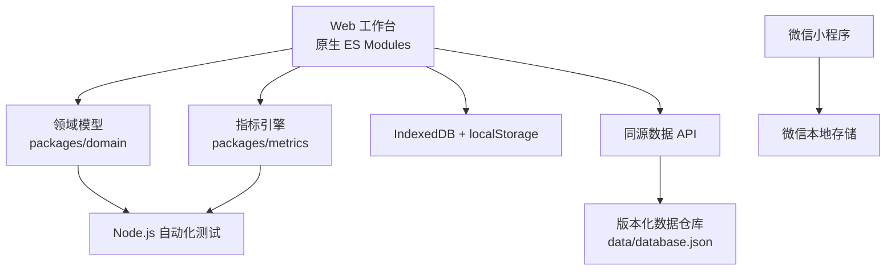

# 新媒体增长作战台

面向新媒体运营的内容策略、达人合作与投放复盘工作台。


## 项目定位

这不是一个只负责生成标题的文案工具，而是一套围绕“营销战役”运行的运营闭环：



项目同时支持 Web 工作台、版本化服务器同步和原生微信小程序伴侣。

## 界面预览

| 数据总览 | 数据复盘 |
|---|---|
|  |  |



## 已实现功能

### 数据管理

- 营销战役管理：目标、预算、平台、周期、人群和负责人
- 内容与达人合作统一管理
- 成本、曝光、互动、点击、订单、收入和毛利录入
- CSV 模板、CSV 导入、CSV / JSON / XLSX 导出
- IndexedDB + localStorage 双持久化
- 同源服务器同步、手动推送和版本冲突保护

### 数据分析

- CPM、CPE、CTR、CVR、CPA、ROAS、ROI
- 同平台、同类型、同粉丝层级效率指数
- 四种 benchmark 范围切换
- 24 小时、72 小时、7 天等指标快照
- SVG 快照增长图
- 战役周度成本与收入趋势
- CPE 异常、转化断层、质量下降和数据过期检测

### 决策辅助

- 根据战役目标生成系统行动建议
- 显示同层级样本量和判断置信度
- 输出继续投放、暂停、优化素材、更换达人、延长观察
- 一键采用建议并记录负责人和复盘备注
- 导出可直接复盘的 Markdown 报告

### 微信小程序

- 总览、记录列表、快速录入
- 与 Web 统一的指标公式
- 微信本地存储
- 无需 npm 依赖，可直接导入微信开发者工具

## 指标口径

| 指标 | 公式 |
|---|---|
| 总成本 | 达人报价 + 广告费 + 样品成本 + 服务费 |
| 互动数 | 点赞 + 收藏 + 评论 + 分享 |
| 互动率 | 互动数 ÷ 阅读/播放量 |
| CPM | 总成本 ÷ 曝光量 × 1000 |
| CPE | 总成本 ÷ 互动数 |
| CTR | 点击量 ÷ 曝光量 |
| CVR | 订单数 ÷ 点击量 |
| CPA | 总成本 ÷ 订单数 |
| ROAS | 归因收入 ÷ 总成本 |
| ROI |（归因毛利 - 总成本）÷ 总成本 |

没有收入或毛利时只展示效率指标，不输出虚假 ROI。

## 一键启动

Windows 下直接双击项目根目录的：

```text
启动工作台.cmd
```

启动器会自动查找系统 Node 或 Codex 内置 Node，等待服务就绪并打开浏览器，不需要手动配置 `PATH`。

## 手动启动

```powershell
cd D:\Codex\xinmeiti-growth-copilot
node apps/web/server.mjs
```

如果系统未配置 Node：

```powershell
& "C:\Users\张佳怡\.cache\codex-runtimes\codex-primary-runtime\dependencies\node\bin\node.exe" apps/web/server.mjs
```

打开：

[http://127.0.0.1:4173](http://127.0.0.1:4173)

## 服务器同步

默认数据文件：

```text
data/database.json
```

该文件已被 Git 忽略。需要外部访问保护时设置：

```powershell
$env:SYNC_TOKEN = "your-token"
node apps/web/server.mjs
```

接口：

- `GET /api/health`
- `GET /api/database`
- `PUT /api/database`

`PUT` 使用 `baseRevision` 校验版本。版本过期时返回 `409`，防止多人编辑互相覆盖。详细说明见 [数据同步 API](docs/数据同步API.md)。

## 微信小程序

使用微信开发者工具导入：

```text
D:\Codex\xinmeiti-growth-copilot\apps\miniapp
```

当前使用 `touristappid` 便于本地运行。正式发布需要替换 AppID，并配置隐私政策、HTTPS 备案域名和正式服务端接口。

## 测试与验收

运行全部自动化测试：

```powershell
node --test
```

运行浏览器和服务器烟测：

```powershell
npm run smoke
```

当前验证结果：

- 32 项自动化测试通过
- 服务器 Revision 正常递增
- 版本冲突和 Token 鉴权测试通过
- Web 五个页面无运行异常
- 8 条演示记录、24 个指标快照
- XLSX、异常检测、趋势图和战役趋势均通过浏览器验证

## 技术架构



项目运行时零第三方依赖，使用 Node.js 内置模块、原生浏览器 API 和零依赖 Open XML 实现。

## 项目结构

```text
xinmeiti-growth-copilot/
├─ apps/
│  ├─ web/                 # Web 工作台和服务器
│  └─ miniapp/             # 原生微信小程序
├─ packages/
│  ├─ domain/              # 数据模型、校验和演示数据
│  └─ metrics/             # 指标、趋势、建议和异常检测
├─ docs/
│  ├─ images/              # README 界面截图
│  ├─ 产品需求.md
│  ├─ 数据字典.md
│  ├─ 指标口径.md
│  └─ 数据同步API.md
├─ scripts/
│  ├─ start.ps1            # 一键启动
│  ├─ browser-smoke.mjs    # 浏览器烟测与截图
│  └─ build.mjs
├─ data/                   # 运行时服务器数据目录
└─ 启动工作台.cmd
```

## 数据与隐私

- Web 数据同时保存到 IndexedDB、localStorage 和同源服务器
- 服务器默认只监听 `127.0.0.1`
- 团队部署时应启用 `SYNC_TOKEN`
- 达人报价、订单、收入和毛利属于敏感数据，分享前应检查
- 正式云部署不应继续使用本地 JSON 文件

## 后续路线

- 接入 CloudBase/PostgreSQL
- 多账号、团队角色和审计日志
- XLSX 导入、模板版本和数据校验报告
- 服务端 AI 策略助手
- 小程序与 Web 的跨端同步
- 定时复盘提醒和异常通知

## 当前状态

项目已经形成可运行的完整闭环，适合用于新媒体运营实际工作、内部演示和求职作品集展示。